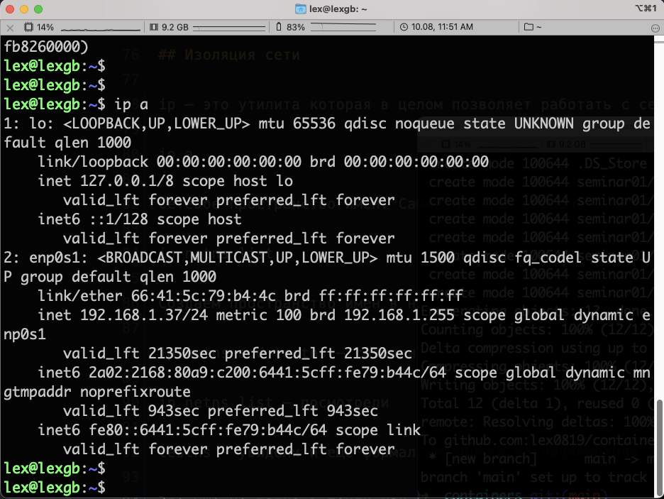
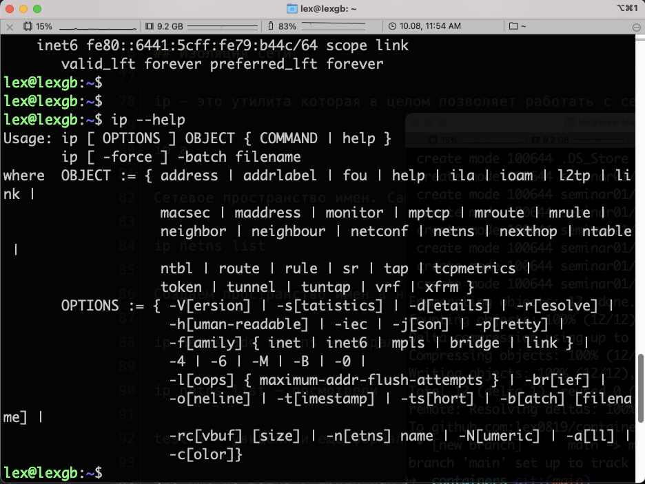
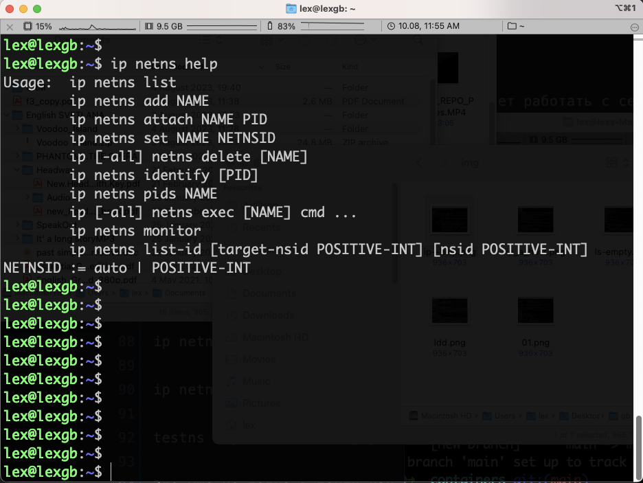
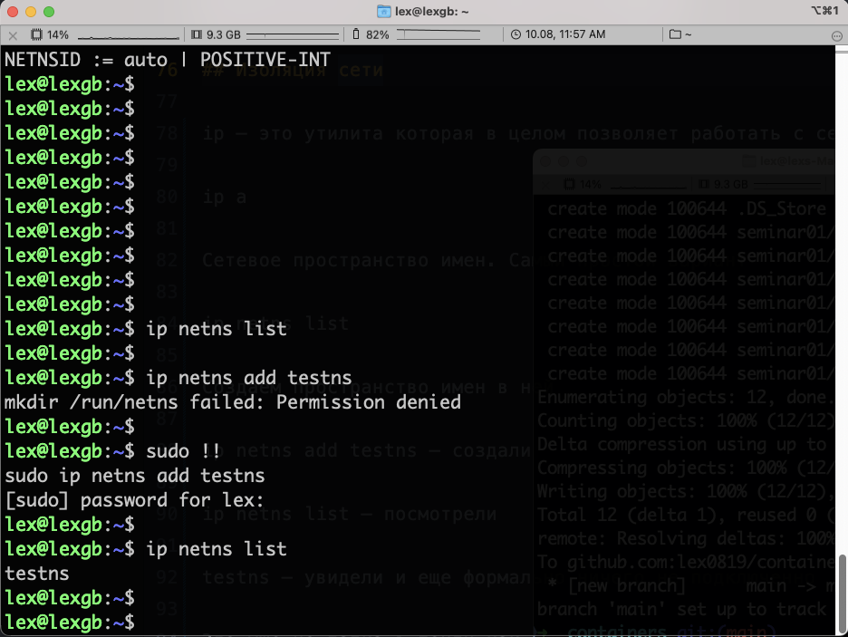
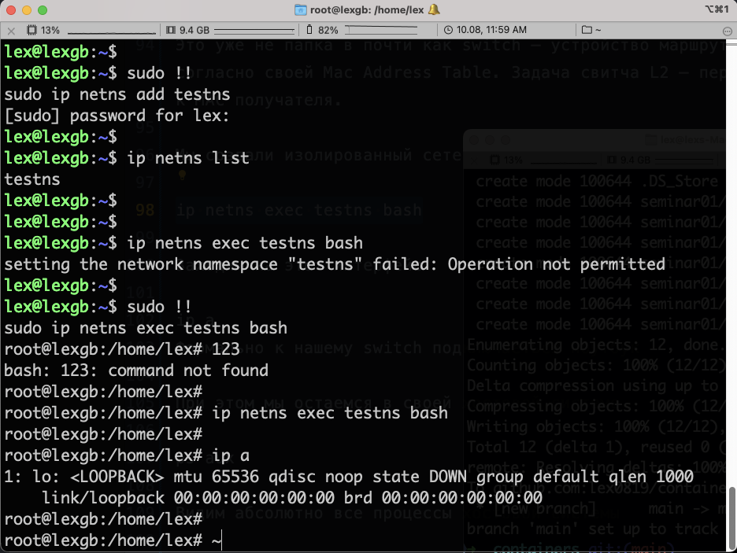
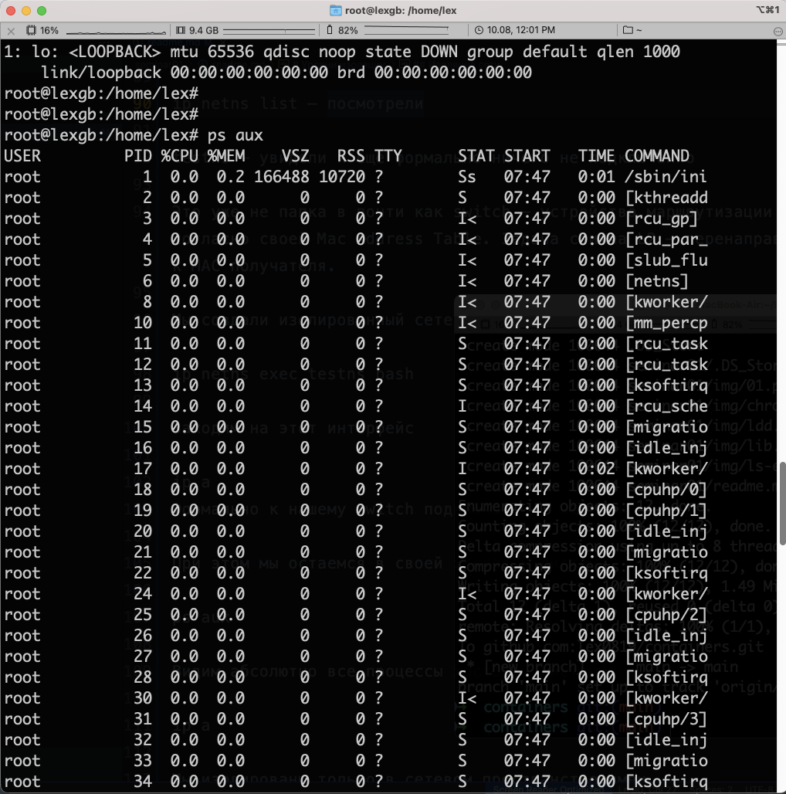
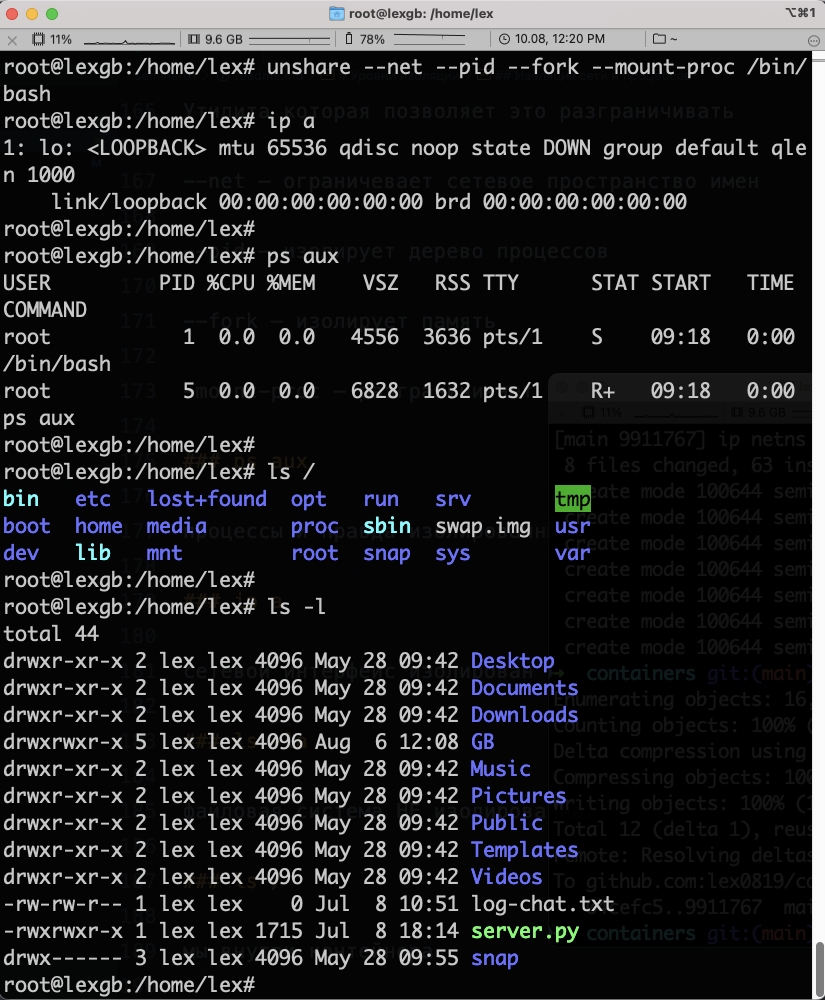

# Уровни изоляции

## Изоляция корня chroot

Вызов chroot на практике.

Для этого создадим каталог "testfolder" в домашнем каталоге пользователя и запустим команду chroot.

Создаем директорию "testfolder":

mkdir testfolder

Копируем исполняемый файл командного интерпретатора /bin/bash в папку

"testfolder/bin":

cp /bin/bash testfolder/bin

Проверяем командой ldd зависимости для процесса /bin/bash

не видим 64-х разрядных папок потому, что находимся на хостовой машине с **arm** процессором **m2**, куда в принципе невозможно поставить системы х-86 и нет разделения на 32-битную и 64-битную архитектуру.

Копируем необходимые библиотеки в папку "testfolder/lib".
Пример:

cp /lib/x86_64-linux-gnu/libtinfo.so.6 testfolder/lib

cp /lib/x86_64-linux-gnu/libc.so.6 testfolder/lib

Запускаем команду chroot для изменения корневой папки:

chroot testfolder /bin/bash

Примечания:

Важно убедиться, что пути к исполняемым файлам и библиотекам соответствуют вашей системе.

Bажно отметить, что chroot имеет свои ограничения и может не обеспечить полную изоляцию процессов.

Теперь можно попытаться сделать смену корня

chroot testfolder

Сейчас все получилось.

Можно увидеть что приветствие системы изменилось.

Мы сменили в данном случае корневую папку , это по сути означает что мы изолировали процесс. По сути у Нас запустилась изолированная оболочка интерпретатора bash, с корнем отличным от файловой системы.

Теперь когда все получилось можно посмотреть текущую директорию с помощью команды
ls

однако есть проблема, программа не найдена

Почему получили эту ошибку.

Ответ довольно прост, как и ранее необходимо скопировать все необходимые исполняемые файлы в созданную папку вместе с динамическими библиотеками, как было показано раньше.

Рассмотрев часть на практике , можно определить серьезный недостаток использования **chroot** — При создании новой корневой директории , необходимо дублировать абсолютно все исполняемые файлы, что несомненно повлечет за собой рост заманиваемого дискового пространства.

## Изоляция пространства имен

Перейдем к Механизму пространства имен, так как он лишен этих проблем.
Пространство имен в системе Линукс, - абстракция в которой находятся все системные ресурсы. Тип ресурса зависит от типа пространства имен. Пространство имен это не дополнительная функция которую можно установить или обойтись без нее. Это сущность которая изначально предоставляется самим ядром ОС и является необходимым компонентом, который принимает участие в процедуре запуска абсолютно любого процесса в системе. И в любой момент времени, любой процесс может принадлежать только одному пространству имен каждого типа. Так же Пространство имен это механизм который обеспечивает изоляцию процессов друг от друга в Юникс Системемах.

## Изоляция сети

ip — это утилита которая в целом позволяет работать с сетью в системе.

ip a

Сетевое пространство имен. Самый простой вариант

ip netns list

Создаем пространство имен в ней

ip netns add testns — создали

ip netns list — посмотрели

testns — увидели и еще формально ничего не подключенно

Это уже не папка в почти как switch — устройство маршрутизации сети по протоколу L2 согласно своей Mac Address Table. Задача свитча L2 — перенаправлять от MAC отправителя к MAC получателя.

Мы создали изолированный сетевой интерфейс testns

ip netns exec testns bash

Заходим на этот интерфейс

ip a

Формально к нашему switch подключаеться ноутбук

При этом мы остаемся в своей хостовой системе

ps aux

Видим абсолютно все процессы хостовой системы

Мы изолированы только в сетевом пространстве имен.

### ip netns help

получим смисок команд

### ip netns add testns

добавим новый интерфейс testns

### ip netns exec testns bash

зашли внутрь изолированной среды этого сетевого интерфейса

### ip a

Видим единственный сетевой интерфейс

lo0, localhost

у нас нет доступа к другим сетевым интерфейсам хостовой системы

### ps aux

видим список всех процессов хостовой системы, здесь нет изоляции

### ip netns delete testns

удалим созданный тестовый изолированный сетевой интерфейс

### rm -r testfolder/

удалим тестовую папку

## Изоляция сети и процессов

### unshare --net --pid --fork --mount-proc /bin/bash

**unshare**
Утилита которая позволяет это разграничивать

--net — ограничевает сетевое пространство имен

--pid — изолирует дерево процессов

--fork — изолирует память

-mount-proc — разграничивает процессы

### ps aux

процессы и правда изолированны

### ip a

сетевой интерфейс изолирован

### ls -la

файловая система НЕ изолированна.

### ls /

мы внутри контейнера и видим все файлы
