# Урок 2. Механизмы контрольных групп

## Задание:

1. запустить контейнер с ubuntu, используя механизм LXC
2. ограничить контейнер 256 Мб ОЗУ и проверить, что ограничение работает
3. По желанию
4. добавить автозапуск контейнеру, перезагрузить ОС и убедиться, что контейнер действительно запустился самостоятельнo
5. при создании указать файл, куда записывать логи
6. после перезагрузки проанализировать логи

## /etc/group

все группы в файле

```bash
# vim /etc/group
```

группа sys - доступ к выполнению программ ядра

часть групп - это созданы служеб программами, чтоб дать права на выполнение утилит с высоким приоритетом безопасности

```bash
# ls -la /dev/
```

дисковые устройства
user root
group disk

```bash
# ls -la /var/log/
```

часть групп не установлены системой, а сделаны вручную

## cgroup

unshare --fork --pid --mount-proc bash
ps aux
free -m (Достунaя ОП)

Ограничены только процессы.

Ресурсы не ограниченны.

Все это надо делать в системе.

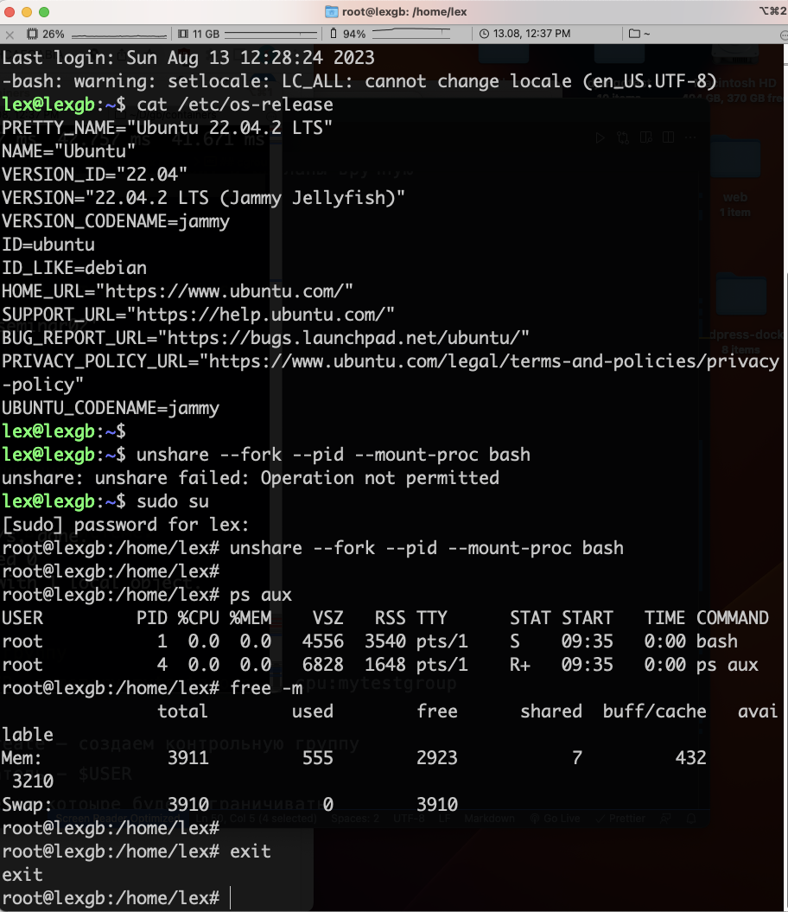

### Install cgroup-tools

```bash
# apt-get install cgroup-tools
```

### Создаем простую группу

cgcreate -a $USER -g memory:mytestgroup -g cpu:mytestgroup

С помощью - cgcreate — создаем контрольную группу

Текущий пользователь - $USER

указываем параметры которые будем ограничивать

Ограничим memory - memory:mytestgroup

Ограничим CPU - cpu:mytestgroup

Посмотрим что она создалась

ls -la /sys/fs/cgroup/mytestgroup

У Нас создалось все необходимое + по CPU и memory (Так как мы указали что хотим менять)

Чтобы постоянно не прописывать , переходим в папку

cd /sys/fs/cgroup/mytestgroup

ls -la

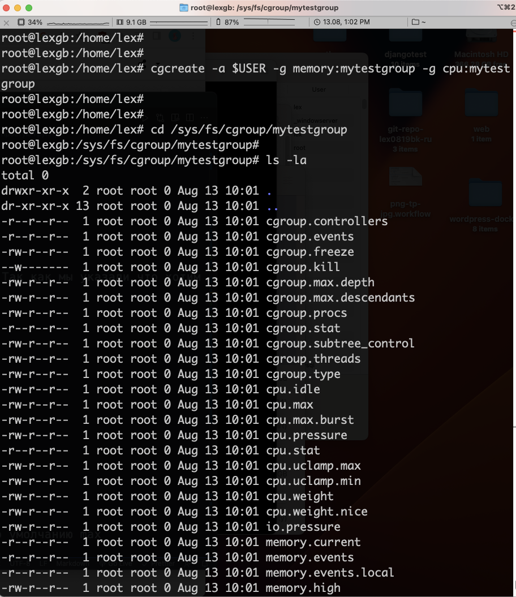

cat memory.max

когда мы создаем контрольную группу, значение ее по умолчанию max

Войдем в нее

cgexec -g memory:mytestgroup bash

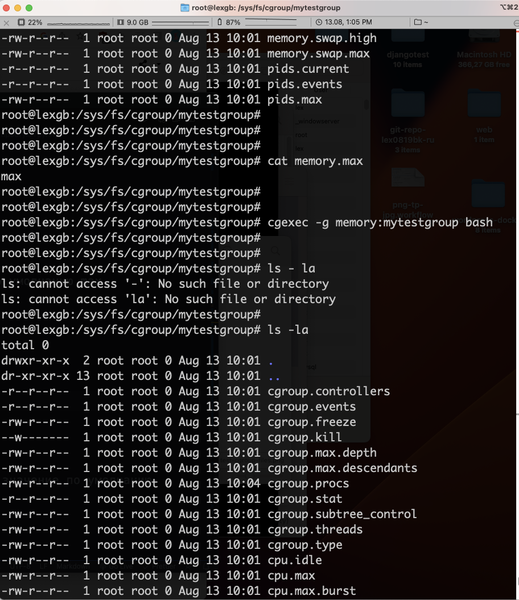

free -m

Смотрим что ограничений нет, все как было, то есть значение по умолчанию.

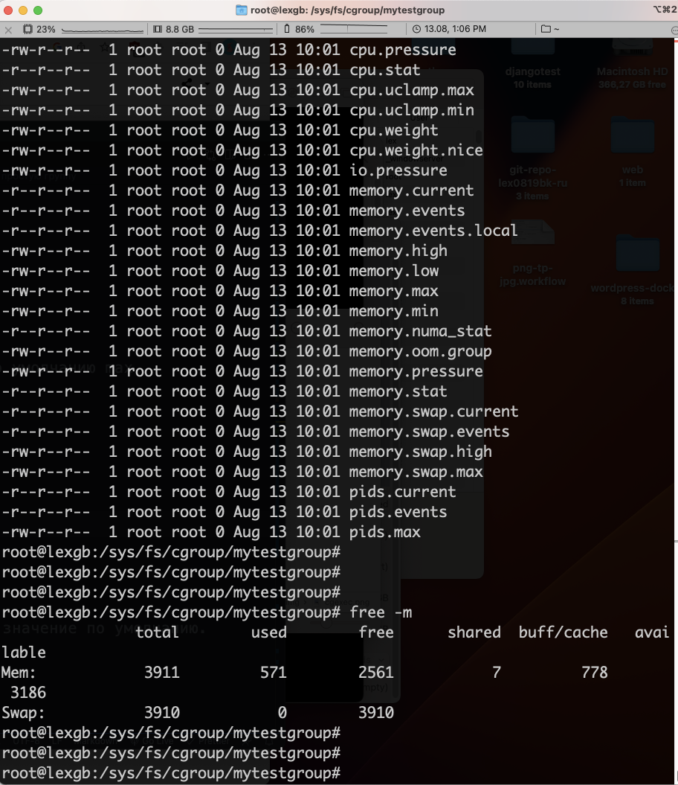

## lxc контейнеры теория

### Создание контейнеры

lxc-create -n <container_name> -t <template>: Создает новый контейнер с указанным именем, используя указанный шаблон.

### Управление контейнером:

lxc-start -n <container_name>: Запускает контейнер.
lxc-stop -n <container_name>: Останавливает контейнер.
lxc-restart -n <container_name>: Перезапускает контейнер.
lxc-destroy -n <container_name>: Удаляет контейнер.

### Получение информации о контейнере:

lxc-info -n <container_name>: Выводит информацию о состоянии и конфигурации контейнера.
lxc-ls -f: Выводит список всех контейнеров на системе.

### Управление сетью:

lxc-network create <network_name>: Создает новую сеть для контейнеров.
lxc-network delete <network_name>: Удаляет сеть контейнеров.
lxc-network list: Выводит список сетей контейнеров.

### Работа с образами:

lxc-image list: Выводит список доступных образов контейнеров.
lxc-image import <image_file> <alias>: Импортирует образ контейнера из файла.
lxc-image delete <alias>: Удаляет образ контейнера по его псевдониму.

### Управление хранением:

lxc-storage list: Выводит список доступных хранилищ контейнеров.
lxc-storage create <storage_pool> <path> <driver>: Создает новое хранилище для контейнеров с указанными параметрами.
lxc-storage delete <storage_pool>: Удаляет хранилище контейнеров.

Это лишь некоторые из основных команд LXC. Существует еще множество других команд и опций для управления контейнерами в LXC. Рекомендуется ознакомиться с официальной документацией LXC или выполнить команду lxc-help для получения полного списка команд и дополнительной информации.

## lxc контейнеры практика

### Установка lxc

```bash
# apt update
# apt-get install lxc debootstrap bridge-utils lxc-templates
# apt-get install lxd-installer
# lxd init
# lxc storage list
```

lxd init(Здесь просто нажимаем на Enter что установились значения по умолчанию)

### Проверяем

lxc storage list

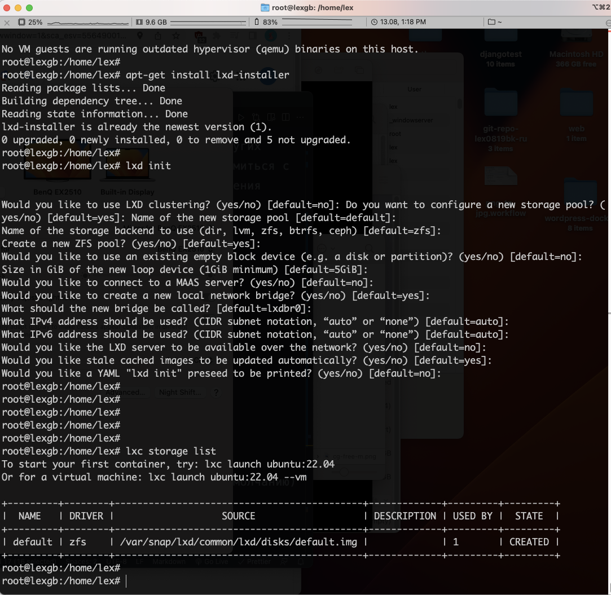

lxc network list

ip a

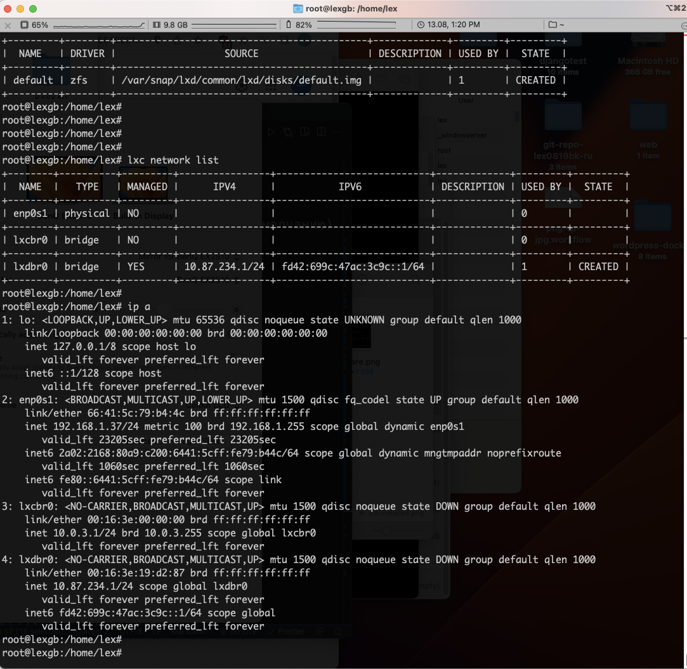

### Создаем lxc контейнер

lxc-create -n test123 -t ubuntu --создаем контейнер

lxc-start -n test123 -- запускаем

lxc-attach -n test123 -- войдем в него

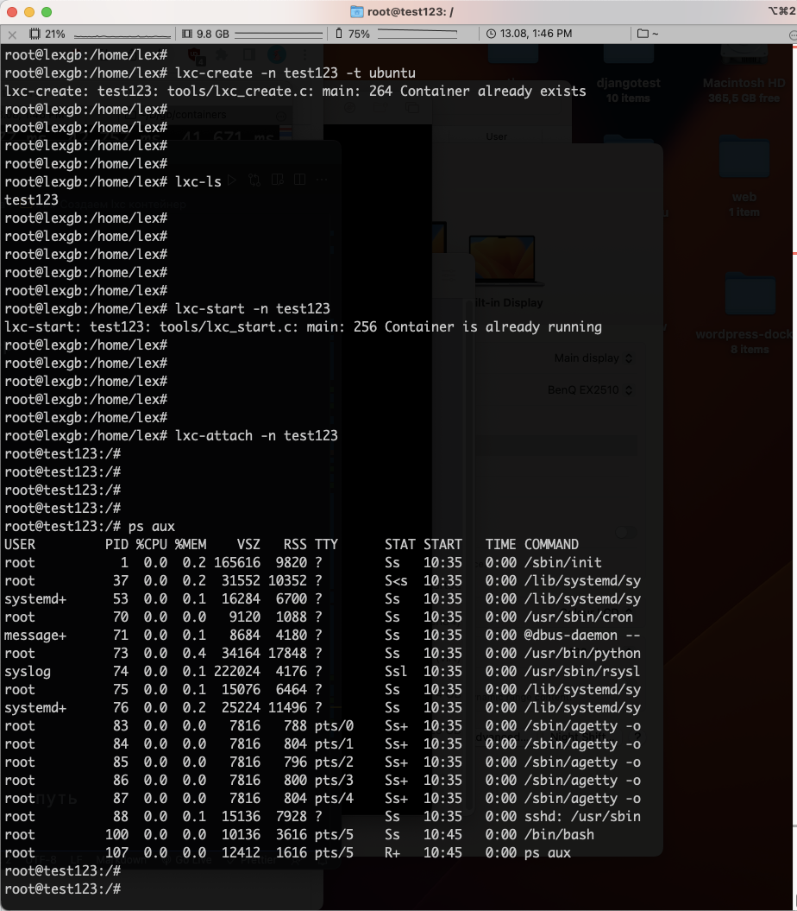

free -m —проверяем пямять

exit -- выходим

lxc-stop -n test123 - -закрываем

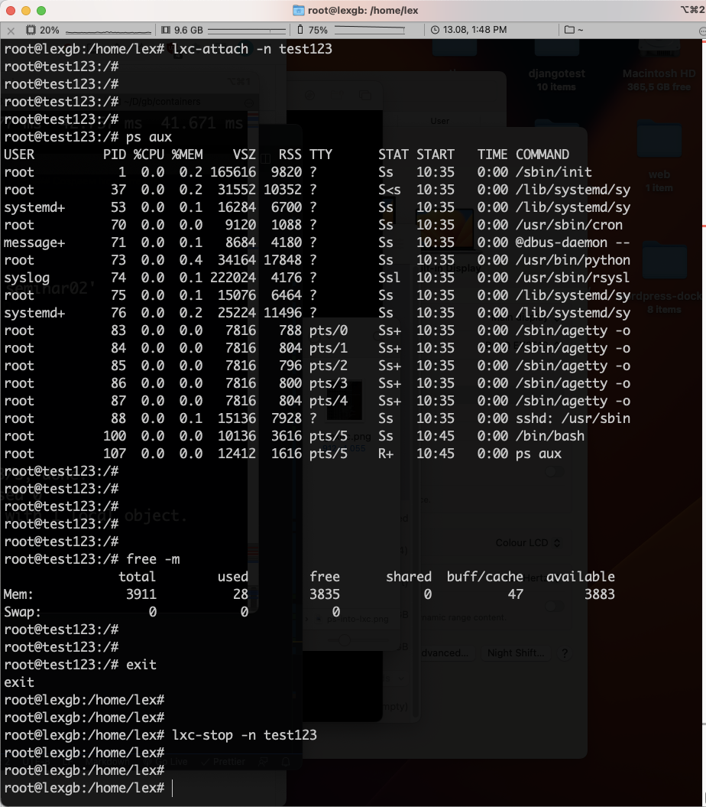

### Ограничиваем lxc контейнер

```bash
# vim /var/lib/lxc/test123/config-открываем
lxc.rootfs.path = dir:/var/lib/lxc/test1234/rootfs — путь
lxc.uts.name = test1234 -- имя

Network configuration — Конфегурация сети
.
.
.
lxc.cgroup2.memory.max = 256M -- ограничиваем(В режиме Вставка делаем запись)

:wq -- сохраняем и выходим(в режиме Записи)
```

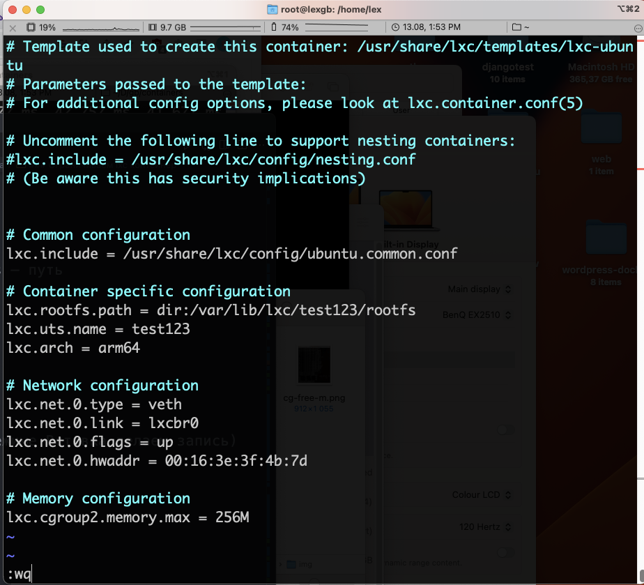

проверяем конфиг lxc контейнера test123

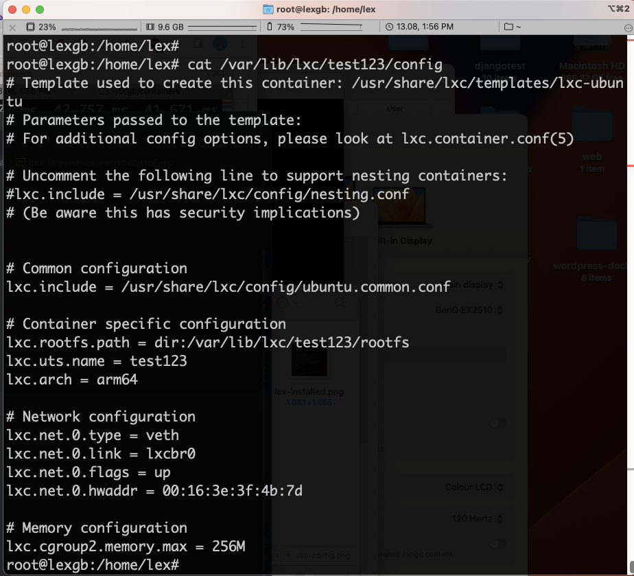

lxc-start -n test123 -- запускаем

lxc-attach -n test123 -- войдем в него

free -m -- проверяем пямять

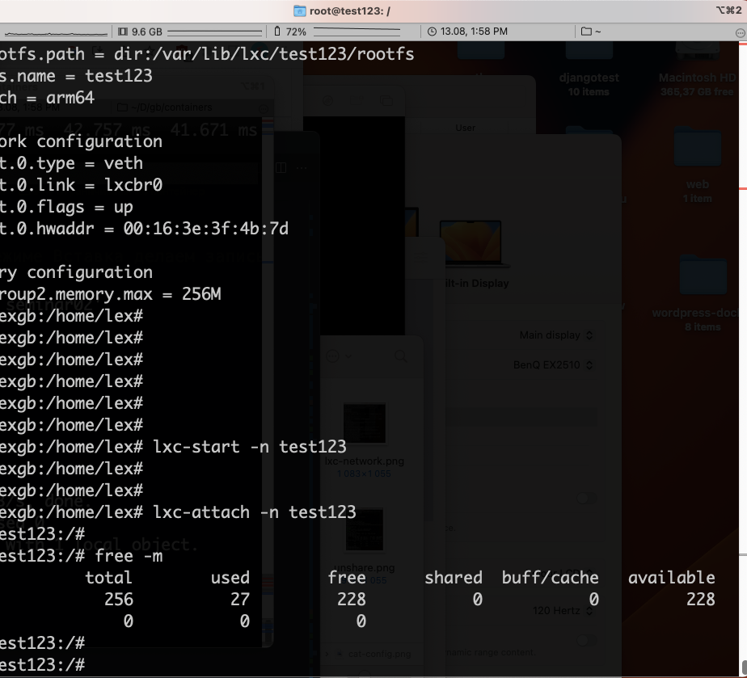

!!!Видим что наше ограничение работает!!!
