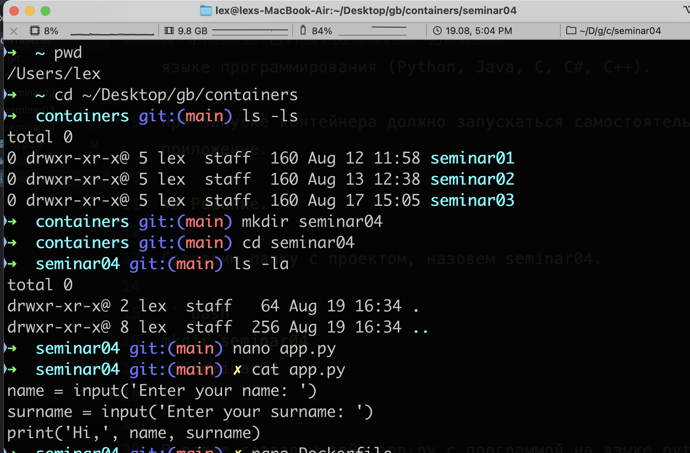
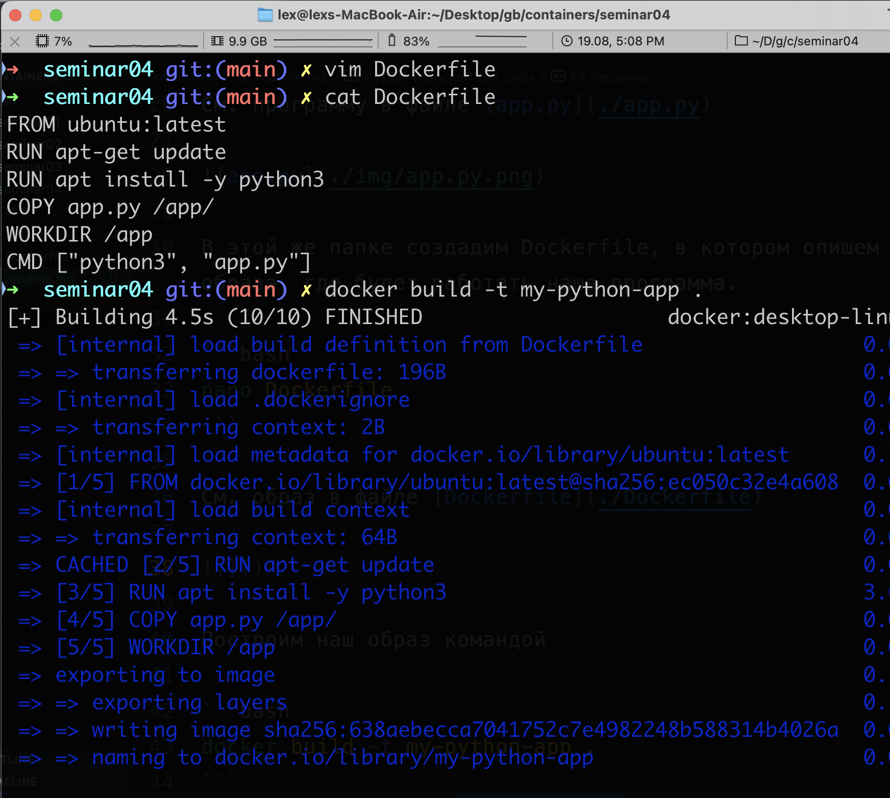
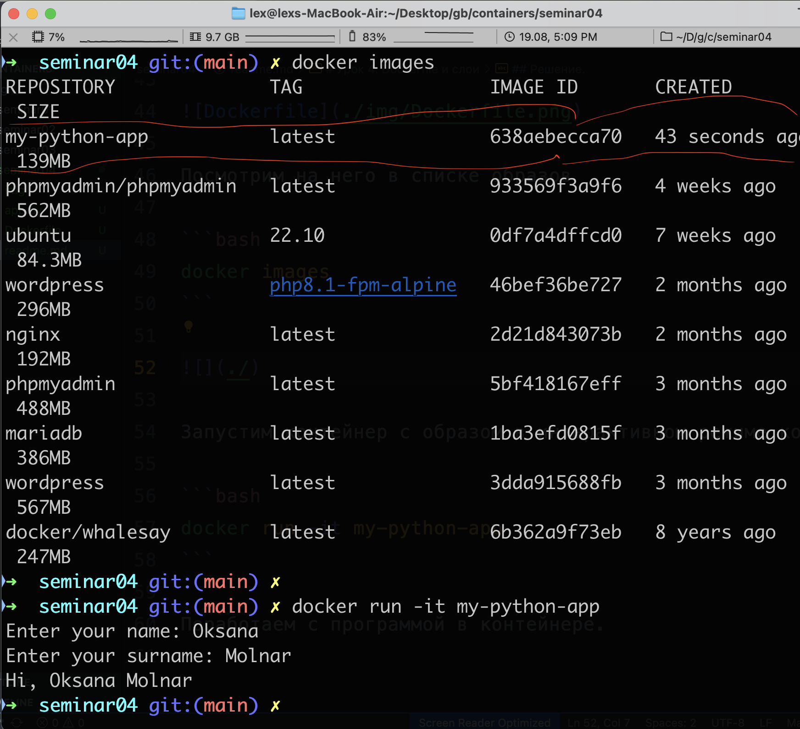

# Урок 4. Dockerfile и слои

## Задание:

необходимо создать Dockerfile, основанный на любом образе (вы в праве выбрать самостоятельно).

В него необходимо поместить приложение, написанное на любом известном вам языке программирования (Python, Java, C, С#, C++).

При запуске контейнера должно запускаться самостоятельно написанное приложение.

## Решение.

Создадим папку с проектом, назовем seminar04.

```bash
mkdir seminar04
cd seminar04
```

В папке создадим файл app.py с программой на языке python.

```bash
nano app.py
```

См. программу в файле [app.py](./app.py)



В этой же папке создадим Dockerfile, в котором опишем слои для создания образа, где будет работать наша программа.

```bash
nano Dockerfile
```

См. образ в файле [Dockerfile](./Dockerfile)

Построим наш образ командой

```bash
docker build -t my-python-app .
```



Посмотрим на него в списке образов

```bash
docker images
```

Запустим контейнер с образом в интерактивном режиме командой

```bash
docker run -it my-python-app
```

Поработаем с программой в контейнере.


