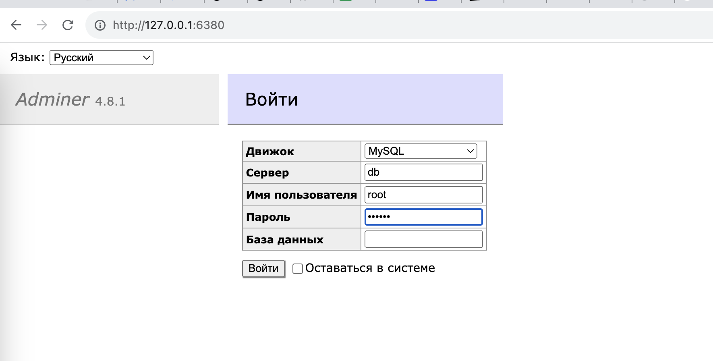

# Урок 5. Docker Compose и Docker Swarm

## создать сервис, состоящий из 2 различных контейнеров: 1 - веб, 2 - БД (compose)

### Создадим новую папку с проектом.

В ней создадим **docker-compose.yml** файл, в котором создадим два контейнера.

Содержимое файла см [docker-compose.yml](./docker-compose.yml)

Пробросим 8080 порт adminer-а наружу в хостовую машину на порт 6380.

### Запустим файл на выполнение

Пройдет скачивание образов с docker hub, создание и запуск контейнеров.

### Проверим работу веб интерфейса adminer

Откроем в браузере его страницу на локалхосте и на порту 6380

Видим веб интерфейс, вводим логин-пароль, который указан в docker-compose.yml файле.

Заходим внутрь системы управления БД.

Все работает.

### Проинспектируем контейнеры.

В CLI запустим инспектирование контейнеров по их ID и выведем результаты инспекции в соответствующие файлы.

См результаты инспекции контейнеров в файлах

[adminer.inspect](./adminer.inspect)

[mariadb.inspect](./mariadb.inspect)

### Закончим работу с контейнерами

Сначала остановим контейнеры и посмотрим на них.

Затем удалим контейнеры.

Оставим только образы, скаченные с docker hub.

